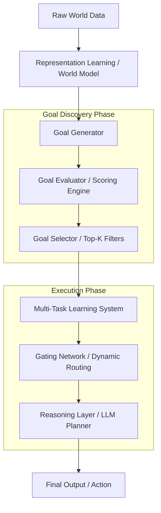

# Goal-Driven Learning Architecture: A Scalable Paradigm for Autonomous AI

## Vision
The Goal-Driven Learning (GDL) architecture represents a shift from fixed-task artificial intelligence to autonomous systems capable of discovery, prioritization, and execution. Unlike traditional models that rely on human-defined objectives, GDL aims to build systems that independently identify useful goals, learn the necessary representations to achieve them, and dynamically select the most relevant objectives to solve in any given context.

## Core Philosophy: Beyond Static Inference
Traditional AI systems are typically constrained by static objectives defined during the training phase. GDL introduces a "Goal Discovery" layer that operates ahead of execution, ensuring the system not only solves problems but also evaluates which problems are worth solving. This is a foundational step toward truly autonomous learning systems.

## System Architecture and Workflow

### 1. Representation Learning (World Model)
The system begins by compressing raw multimodal data into a latent world representation (Z). This model—potentially utilizing Transformer or JEPA-like architectures—serves as the foundational understanding of reality upon which all goals are built.

### 2. Goal Generator
The system generates a massive space of candidate goals (G) rather than a small set of fixed tasks. These goals include:
*   Multi-horizon prediction tasks.
*   Causal relationship modeling.
*   Anomaly and pattern detection.
*   Clustering and classification of latent states.

### 3. Goal Evaluator and Selector
To prevent "goal explosion," a scoring engine evaluates each candidate based on performance, utility, information gain, and generalization potential. The Selector then filters these into a manageable "Top-K" set of core capabilities, removing redundant or low-value tasks.

### 4. Multi-Task Learning and Gating
The execution engine uses a Shared Encoder with Multiple Expert Heads. At the point of inference, the Gating Network performs dynamic routing, activating only the most relevant goals for the specific input. This mirrors Mixture of Experts (MoE) efficiency, ensuring scalability and reduced compute overhead.

### 5. Reasoning and Action Layers
The outputs of the activated goals are passed to a Reasoning Layer (often an LLM or specialized planner) that synthesizes the information into human-understandable explanations or concrete action plans.

## Technical Comparison

| Feature | Traditional AI | Goal-Driven AI |
| :--- | :--- | :--- |
| **Task Definition** | Fixed / Human-defined | Dynamic / System-discovered |
| **Objectives** | Static | Evaluated and prioritized |
| **Architecture** | Single-purpose | Multi-capability / Modular |
| **Inference** | Static execution | Adaptive context-aware routing |

## Compute Strategy and Efficiency
To ensure scalability, GDL employs a bifurcated compute strategy:
*   **Training**: Cheap screening of a wide goal space, with full resource allocation reserved for selected high-value goals.
*   **Inference**: Selective activation of Top-K goals avoids the computational cost of running the full model for every query.

## Applications
*   **Enterprise Analytics**: Autonomous discovery of business insights and risk patterns.
*   **Adaptive EdTech**: Dynamic goal setting for personalized student learning paths.
*   **Autonomous Robotics**: Real-world decision making in unpredictable environments.
*   **Cybersecurity**: Dynamic anomaly detection and threat modeling.

## Challenges and Research Directions
The current prototype focuses on the validation of the Gating Mechanism and latent representation sharing. Future research will address:
*   Managing the complexity of the Goal Evaluator scoring logic.
*   Ensuring the stability of learning across thousands of dynamic heads.
*   Integrating Continual Learning systems to allow the model to evolve its goal space over time without catastrophic forgetting.

## Summary
An AI system that learns not just how to solve problems, but which problems are worth solving. This architecture provides the blueprint for a learning paradigm that moves from tool-like AI to autonomous, goal-oriented intelligence.
